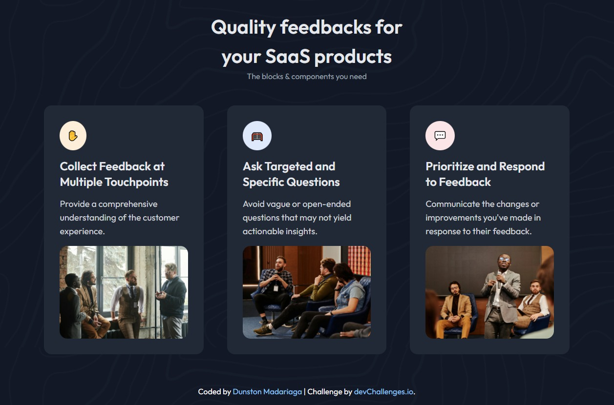

<!-- Please update value in the {}  -->

<h1 align="center">Simple Feature Section | devChallenges</h1>

   Solution for a challenge <a href="https://devchallenges.io/challenge/simple-feature-section-challenge" target="_blank">Simple Feature Section</a> from <a href="http://devchallenges.io" target="_blank">devChallenges.io</a>.

  <h3>
    <a href="https://devchallenge-simple-feature-section.netlify.app">
      Demo
    </a>
     | 
    <a href="https://devchallenge-simple-feature-section.netlify.app">
      Solution
    </a>
     | 
    <a href="https://devchallenges.io/challenge/simple-feature-section-challenge">
      Challenge
    </a>
  </h3>

<!-- TABLE OF CONTENTS -->

## Table of Contents

- [Overview](#overview)
  - [What I learned](#what-i-learned)
- [Built with](#built-with)
- [Features](#features)
- [Author](#Author)

<!-- OVERVIEW -->

## Overview

### What I learned

This challenge helped me learn about flex-wrap.

### Built with

- Semantic HTML5 markup
- Flexbox
- [Tailwind](https://tailwindcss.com/)

## Features

This application/site was created as a submission to a [DevChallenges](https://devchallenges.io/challenges-dashboard) challenge.

## Author

- Website [Simple Feature Section](https://devchallenge-simple-feature-section.netlify.app)
- GitHub [Pogo182028](https://github.com/Pogo182028/Simple-Feature-Section)
